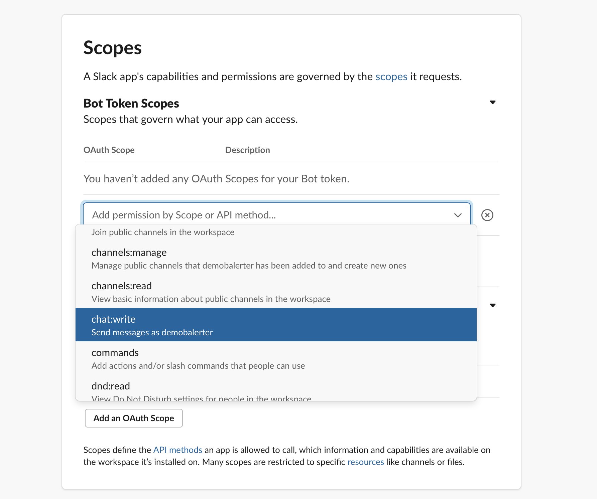

1. Создаем приложение приложение на странице `https://api.slack.com/apps?new_app=1`

2. В разделе `OAuth & Permissions` `https://api.slack.com/apps/<ID>/oauth` необходимо добавить Скоупы для бота 
    - `chat:write`
    - `incoming-webhook`

3. Устанавливаем приложение в ваш воркспейс, выбрав канал, куда оно будет отправлять сообщения и копируем `OAuth Access Token`, который будет показан на экране

4. Внутри Slack добавляем это приложение в канал, куда требуется отправлять уведомления (в канале жмем ссылку `Add an app`)

5. OAuth токен вписываем в конфиг Balerter

6. Готово. Вы великолепны!