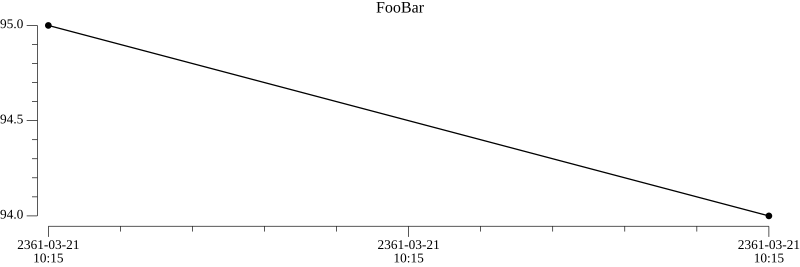

This endpoint allows to use [chart](/core-modules/chart) core module

## render

### request

> `POST /chart/render`

Request body format:

```json
{
    "title": "chart title",
    "series" [<series data>]    
}
```

Series data:

> see [chart module documentation](/core-modules/chart) about series data format

```json
{
  "color": "red",
  "line_color": "",
  "point_color": "",
  "data": [<data>]
}
```

Data:

```json
{
  "timestamp": 123123123123,
  "value": 10.20
}
```

Example

```bash
curl -X "POST" "http://127.0.0.1:2020/chart/render" \
     -H 'Content-Type: application/json; charset=utf-8' \
     -d $'{
  "title": "FooBar",
  "series": [
    {
      "data": [
        {
          "value": 95,
          "timestamp": 12345646554
        },
        {
          "value": 94,
          "timestamp": 12345646555
        }
      ]
    }
  ]
}'
```

Its request is analogous to the following lua script:

```lua title="script.lua"
local ch = require("chart")

data = {
    title = "FooBar",
    series = {
        {
            data = {
                {
                    value = 95,
                    timestamp = 12345646554
                },
                {
                    value = 94,
                    timestamp = 12345646555
                }
            }
        }
    }
}

result = ch.render(data)
```

### response

```json
{
  "status": "ok",
  "result": <base64 encoded image>
}
```

Chart response image:

