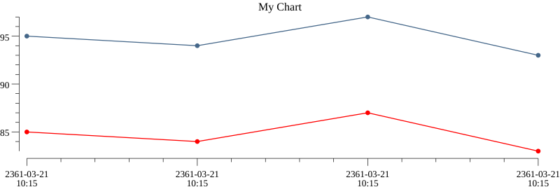
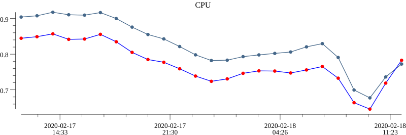

??? success "Core API"
    This module available in Core API

Module `chart` allows to create an image with a chart. After you can upload an image to remote storage and attach to an alert.

Usage:

```lua title="script.lua"
local chart = require('chart')
```

## Methods

### render

`render('<CHART_TITLE>', <CHART_OPTIONS>) binaryImageData, error`

Render image and return it as binary data

If an error occurred, it will be returned as second value

## Chart Options

A structure `<CHART_OPTIONS>` describe data for build a chart

```
{
    series = { <CHART_SERIES>, <CHART_SERIES>, ... } 
}
```

Series is lines on a chart

### Series

```
{
    color = '<COLOR>',
    line_color = '<COLOR>',
    point_color = '<COLOR>',
    data = { <POINT_VALUE>, <POINT_VALUE>, ... }
}
```

`color`, `line_color`, `point_color` allows define a common color, a line color or a point color

If defined only `color` - it will be applying to lines and points
Default color is black

`data` contains data for every points

One point describe as:

```
{
    timestamp = <FLOAT>
    value = <FLOAT>
}
```

### Color

`color` (`color_line`, `color_point`) may have:

One of these values
- blue
- red
- black
- green
- yellow

String `#XXXXXX` for define a color in format RGB or `#XXXXXXXX` for define a color in format RGBA

An example:
```lua
color = 'blue'
color = '#00FF00'
color = '#ABCD12FA'
```

## Examples

Manually define a chart data:

```lua title="script.lua"
local chartOptions = {
    ['series'] = {
        {
            ['color'] = '#456789',
            ["data"] = {
                { ['timestamp'] = 12345646554, ['value'] = 95 },
                { ['timestamp'] = 12345646555, ['value'] = 94 },
                { ['timestamp'] = 12345646556, ['value'] = 97 },
                { ['timestamp'] = 12345646557, ['value'] = 93 }
            }
        },
        {
            ['color'] = 'red',
            ["data"] = {
                { ['timestamp'] = 12345646554, ['value'] = 85 },
                { ['timestamp'] = 12345646555, ['value'] = 84 },
                { ['timestamp'] = 12345646556, ['value'] = 87 },
                { ['timestamp'] = 12345646557, ['value'] = 83 }
            }
        }
    }
}

local img, err = chart.render('My Chart', chartOptions)

-- 'img' will be contains an image binary data  
```

Result image



Obtain a data from Prometheus (Usage metrics from [NodeExporter](https://github.com/prometheus/node_exporter))

```lua title="script.lua"
local rangeOptions = {
    ['start'] = r - 86400,
    ['end'] = r,
    ['step'] = '3600'
}

res1 = prom.range('rate(sum(node_cpu_seconds_total{mode!="idle",node="32"}[5m])) / rate(sum(node_cpu_seconds_total{node="32"}[5m]))', rangeOptions)
res2 = prom.range('rate(sum(node_cpu_seconds_total{mode!="idle",node="43"}[5m])) / rate(sum(node_cpu_seconds_total{node="43"}[5m]))', rangeOptions)

local chartOptions = {
    ['series'] = {
        {
            ['color'] = '#456789',
            ["data"] = res1[1].values,
        },
        {
            ['color'] = 'red',
            ['line_color'] = 'blue',
            ["data"] = res2[1].values,
        }
    }
}


local img, err = chart.render('CPU', chartOptions)

-- 'img' will be contains an image binary data  
```

Result image



## Send image

You can store received image to the [upload storage](/configuration/sections/storages-upload/) and then use image URL.

For telegram channel you can send raw image data without upload to the storage 